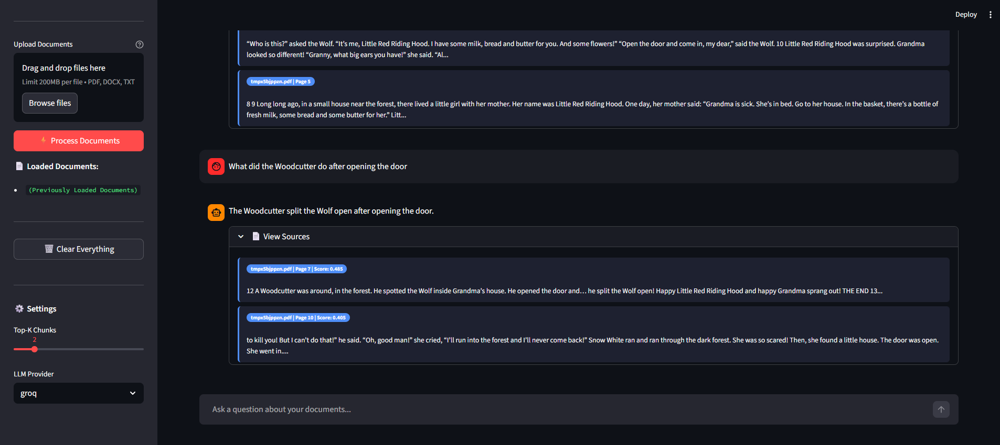

# 🤖 QA Bot — Ask Your Documents

Welcome to **QA Bot**, an intelligent Question Answering System powered by Retrieval-Augmented Generation (RAG). Turn your unstructured documents (PDFs, Word documents, text files) into an interactive, knowledgeable AI assistant.

---

## 🚀 Overview

QA Bot leverages the power of Large Language Models (LLMs) combined with dense vector embeddings to give you fast, accurate, context-grounded answers. Instead of hallucinating, the bot automatically retrieves the most relevant chunks from your uploaded documents and references them in its responses. 

### ✨ Key Features
- **Multi-Format Document Ingestion:** Simply drag and drop PDFs, DOCX, or TXT files.
- **Fast Similarity Search:** Powered by local, persistent vector storage via **ChromaDB**.
- **Flexible AI Integration:** Instantly swap between LLM providers such as **Groq**, **Google Gemini**, and **Hugging Face**.
- **Conversational Memory:** The bot remembers the context of your previous questions natively! 
- **Beautiful UI:** A highly interactive chat interface built with **Streamlit**, featuring expandable source citations.

---

## 🛠️ Technology Stack
- **Interface:** Streamlit & FastAPI
- **Orchestration:** LangChain
- **Embeddings:** `sentence-transformers` (all-MiniLM-L6-v2)
- **Vector Database:** ChromaDB 
- **LLM Pipeline:** Groq / Google GenAI / HuggingFace Pipelines

---

## 📄 Project Documentation

For a deep dive into the business goals, functional requirements, and project scope, please refer to the following standard project documents:
- [**Business Requirements Document (BRD)**](BRD.md)
- [**Functional Requirements Document (FRD)**](FRD.md)
- [**Statement of Work (SOW)**](SOW.md)

---

## 🎨 Application Interface

*(Save your Streamlit screenshot as `docs/image.png` to display it here!)*

<p align="center">
  
</p>

---

## 🏗️ Project Structure
```text
qa_bot/
├── app.py                     # Interactive Streamlit Web Interface
├── api.py                     # Headless FastAPI Backend
├── requirements.txt           # Python Dependencies
├── .env                       # Environment credentials
├── SOW.md                     # Statement of Work
├── BRD.md                     # Business Requirements Document
├── FRD.md                     # Functional Requirements Document
├── src/                       
│   ├── ingestion/             # Document parsing & chunking modules
│   ├── retrieval/             # Embedding & Vector store operations
│   └── generation/            # RAG chains & conversational logic
├── scripts/                   # Auxiliary and testing scripts
├── data/                      # Permanent Vector Storage & raw files
└── docs/                      # UI Screenshots and diagrams
```

---

## 🏃‍♂️ Getting Started

### 1. Requirements & Setup
Clone the repository and install the dependencies in a virtual environment:
```bash
python -m venv venv
venv\Scripts\activate   # On MacOS/Linux use: source venv/bin/activate
pip install -r requirements.txt
```

### 2. Configure Environment Keys
Create a `.env` file in the root directory. Add your active API tokens:
```env
GROQ_API_KEY=your_key_here
GEMINI_API_KEY=your_key_here
HUGGINGFACE_API_KEY=your_key_here
```

### 3. Launch the Application!
Start the Streamlit interface safely:
```bash
streamlit run app.py
```
Upload your documents using the sidebar, click **⚡ Process Documents**, and start chatting immediately!

---

*Prepared by Rahul*
